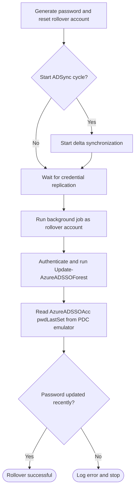

<div align="center">
  

  # AzKerberosRollOver

  **Automated Kerberos key rollover for Microsoft Entra seamless single sign-on**

  [](https://learn.microsoft.com/powershell/)
  [](https://www.microsoft.com/windows)
  [](https://www.microsoft.com/security/business/identity-access/microsoft-entra-id)
  [](LICENSE)

  [Getting started](#getting-started) · [How it works](#how-it-works) · [Parameters](#parameters) · [Logging](#logging) · [Development](#development)
</div>

---

## Overview

AzKerberosRollOver automates the rollover of the Microsoft Entra seamless single sign-on Kerberos decryption key. The PowerShell script resets a synchronized Active Directory rollover account and updates the `AzureADSSOAcc` computer account through the Microsoft `AzureADSSO` module.

Microsoft Entra seamless SSO uses the `AzureADSSOAcc` computer account in Active Directory to encrypt and decrypt Kerberos tickets. The password of this account acts as the Kerberos decryption key. [Microsoft recommends rolling over this key at least every 30 days](https://learn.microsoft.com/entra/identity/hybrid/connect/how-to-connect-sso-faq#how-can-i-roll-over-the-kerberos-decryption-key-of-the-%60azureadsso%60-computer-account) to limit how long a compromised key could be used.

| Identity | Purpose |
| --- | --- |
| **Rollover account** | A synchronized user account, such as `AzKrbRollOver`, whose password is reset by the script. After synchronization, the new credential authenticates to Active Directory and Microsoft Entra ID. |
| **`AzureADSSOAcc`** | The computer account containing the seamless SSO Kerberos key. Its password is rotated by `Update-AzureADSSOForest`. |

> [!IMPORTANT]
> Before making changes, the script checks when `AzureADSSOAcc` was last updated. This prevents a new key from being generated while Kerberos tickets encrypted with the previous key may still be valid.

## Highlights

| | Capability |
| --- | --- |
| 🛡️ | Enforces a configurable minimum interval between key rollovers. |
| 🔎 | Discovers `AzureADSSOAcc` across the forest through a Global Catalog. |
| 🔑 | Generates a new 32-character password for the rollover account. |
| 🔄 | Optionally starts a Microsoft Entra Connect delta synchronization. |
| 👤 | Runs the seamless SSO update under the rollover account's identity. |
| ✅ | Verifies the update directly against the PDC emulator. |
| 🧪 | Supports `-WhatIf` validation without changing passwords, starting synchronization, or writing logs. |
| 📝 | Writes diagnostics to a local log and the Windows Application event log. |

## Getting started

### Prerequisites

#### Host

- Windows PowerShell on a Microsoft Entra Connect server.
- Microsoft Entra Connect with seamless SSO configured.
- Network access to a Global Catalog and the PDC emulator.
- Administrative rights when the `AzureKrbRollOver` Application event source must be created for the first time.

#### PowerShell modules

| Module | Purpose |
| --- | --- |
| `AzureADSSO` | Updates the seamless SSO forest configuration. |
| `ActiveDirectory` | Reads and updates Active Directory objects. |
| `ADSync` | Starts an optional Entra Connect delta synchronization. |

The default `AzureADSSO` module path is:

```text
C:\Program Files\Microsoft Azure Active Directory Connect\AzureADSSO.psd1
```

#### Accounts and permissions

- A synchronized Active Directory rollover account, named `AzKrbRollOver` by default.
- The rollover account must have the Microsoft Entra role required by the `AzureADSSO` cmdlets, typically **Hybrid Identity Administrator**.
- The identity running the script must be able to:
  - Reset the rollover account password.
  - Read users, domain controllers, and `AzureADSSOAcc` in Active Directory.
  - Start an ADSync cycle unless `-DoNotStartSync` is used.

### Run the rollover

Open an elevated Windows PowerShell session on the Entra Connect server:

```powershell
.\azKerberosRollover.ps1 `
    -RollOverAccountUPN 'AzKrbRollOver@contoso.com'
```

### Preview safely

Validate the environment and preview the rollover without making changes:

```powershell
.\azKerberosRollover.ps1 `
    -RollOverAccountUPN 'AzKrbRollOver@contoso.com' `
    -WhatIf
```

> [!TIP]
> Start with `-WhatIf` to validate the account, modules, directory access, and timing requirements before the first rollover.

### Additional examples

<details>
<summary><strong>Use a custom account, log directory, and replication delay</strong></summary>

```powershell
.\azKerberosRollover.ps1 `
    -RollOverADAccountName 'SvcKrbRollover' `
    -RollOverAccountUPN 'SvcKrbRollover@contoso.com' `
    -AzureSyncWaitTime 120 `
    -LogPath 'C:\Logs'
```

</details>

<details>
<summary><strong>Skip the ADSync trigger</strong></summary>

Use this option when synchronization is managed separately:

```powershell
.\azKerberosRollover.ps1 `
    -DoNotStartSync `
    -RollOverAccountUPN 'AzKrbRollOver@contoso.com'
```

</details>

> [!CAUTION]
> `-IgnoreTGTLifetimeCheck` bypasses the protection against rolling over the key while Kerberos tickets issued with the previous key may still be active.

## How it works

1. Imports the required PowerShell modules.
2. Validates timing parameters and confirms that the rollover account exists.
3. Locates `AzureADSSOAcc` through a Global Catalog.
4. Checks `pwdLastSet` and stops if the previous rollover is still within the configured Kerberos ticket-granting ticket (TGT) lifetime.
5. Generates a password and resets the synchronized rollover account.
6. Starts an Entra Connect delta synchronization unless synchronization is disabled.
7. Waits for the configured replication interval.
8. Starts a background job under the rollover account and updates the seamless SSO forest configuration.
9. Reads `pwdLastSet` from the PDC emulator and verifies that the update completed.



The complete validation and decision flow is documented in the [developer guide](developer.md#complete-rollover-workflow).

## Parameters

| Parameter | Type | Default | Description |
| --- | --- | --- | --- |
| `AzureADSSOModule` | `String` | Standard Entra Connect path | Full path to `AzureADSSO.psd1`. |
| `RollOverADAccountName` | `String` | `AzKrbRollOver` | Active Directory `sAMAccountName` of the synchronized rollover account. |
| `RollOverAccountUPN` | `String` | AD user UPN | Microsoft Entra UPN of the rollover account. When omitted, it is read from Active Directory. |
| `LogPath` | `String` | `%LOCALAPPDATA%` | Log directory. A supplied file path is reduced to its parent directory. |
| `AzureSyncWaitTime` | `Int32` | `60` | Replication wait time in seconds. Runtime validation restricts it to 15 through 900. |
| `DoNotStartSync` | `Switch` | Disabled | Skips `Start-ADSyncSyncCycle`. |
| `TGTLifetimeHours` | `Int32` | `10` | Minimum password age before another rollover. Runtime validation restricts it to 0 through 24. |
| `IgnoreTGTLifetimeCheck` | `Switch` | Disabled | Forces the workflow to continue regardless of the previous rollover time. |
| `WhatIf` | Common parameter | Disabled | Validates prerequisites and reports the planned rollover without changing passwords, starting synchronization, updating seamless SSO, or writing logs. |

For complete PowerShell help, run:

```powershell
Get-Help .\azKerberosRollover.ps1 -Full
```

## Logging

The script writes:

- All records to `<LogPath>\azKerberosRollover.ps1.log`.
- Information, warning, and error records to the Windows Application event log.
- A single rotated `.sav` log when the active log exceeds 1 MB.

No log files, event sources, or Windows events are created or modified when `-WhatIf` is used.

See the [event ID reference](EventID.md) for all event identifiers and messages.

## Return codes

| Code | Meaning |
| --- | --- |
| `0x0` | The script completed successfully. |
| `0x3EA` | The Windows Application event source could not be created. |

## Scheduled execution

Use Windows Task Scheduler for recurring rollovers. Microsoft recommends regularly rolling over the seamless SSO Kerberos decryption key.

When configuring the task:

1. Use an identity with the permissions listed in [Prerequisites](#prerequisites).
2. Select **Run with highest privileges** if the event source has not been provisioned separately.
3. Allow enough time for credential synchronization by configuring `-AzureSyncWaitTime` appropriately.
4. Review the local and Windows Application event logs after each scheduled run.

## Project resources

| Resource | Description |
| --- | --- |
| [`azKerberosRollover.ps1`](azKerberosRollover.ps1) | Main rollover script and built-in PowerShell help. |
| [Event ID reference](EventID.md) | Windows Application event identifiers and messages. |
| [Changelog](CHANGELOG.md) | Release history and notable changes. |
| [Developer guide](developer.md) | Contributor setup, branch workflow, versioning, and validation. |

## Development

Contributions are welcome. See the [developer guide](developer.md) for repository setup, branch workflow, automatic versioning, changelog generation, and validation guidance.

## License

This project is licensed under the [GNU General Public License v3.0](LICENSE).
