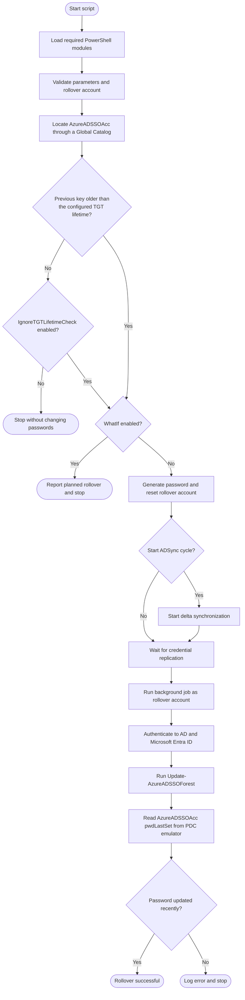

# AzKerberosRollOver

AzKerberosRollOver automates the rollover of the Microsoft Entra seamless single sign-on Kerberos decryption key. The PowerShell script resets a synchronized Active Directory rollover account and updates the `AzureADSSOAcc` computer account through the Microsoft `AzureADSSO` module.

Microsoft Entra seamless SSO uses the `AzureADSSOAcc` computer account in Active Directory to encrypt and decrypt Kerberos tickets. The password of this account acts as the Kerberos decryption key. [Microsoft recommends rolling over this key at least every 30 days](https://learn.microsoft.com/entra/identity/hybrid/connect/how-to-connect-sso-faq#how-can-i-roll-over-the-kerberos-decryption-key-of-the-%60azureadsso%60-computer-account) by using `Update-AzureADSSOForest` to limit how long a compromised key could be used.

The script coordinates this rollover with two identities:

- **Rollover account:** A synchronized user account, such as `AzKrbRollOver`, whose password is reset by the script. After synchronization, the new credential is used to authenticate to both Active Directory and Microsoft Entra ID.
- **`AzureADSSOAcc` computer account:** The account containing the seamless SSO Kerberos key. Its password is rotated by `Update-AzureADSSOForest`.

Before making changes, the script checks when `AzureADSSOAcc` was last updated. This prevents a new key from being generated while Kerberos tickets encrypted with the previous key may still be valid. After the rollover, the script reads `pwdLastSet` directly from the PDC emulator to confirm that the operation succeeded.

## Process overview



## Features

- Enforces a configurable minimum interval between key rollovers.
- Supports `-WhatIf` validation without changing passwords, starting synchronization, or writing logs.
- Discovers `AzureADSSOAcc` across the forest through a Global Catalog.
- Generates a new 32-character password for the rollover account.
- Optionally starts a Microsoft Entra Connect delta synchronization.
- Runs the seamless SSO update under the rollover account's identity.
- Verifies the update directly against the PDC emulator.
- Writes diagnostic information to a local log and the Windows Application event log.

## Requirements

### Host

- Windows PowerShell on a Microsoft Entra Connect server.
- Microsoft Entra Connect with seamless SSO configured.
- Network access to a Global Catalog and the PDC emulator.
- Administrative rights when the `AzureKrbRollOver` Application event source must be created for the first time.

### PowerShell modules

- `AzureADSSO`
- `ActiveDirectory`
- `ADSync`

The default `AzureADSSO` module path is:

```text
C:\Program Files\Microsoft Azure Active Directory Connect\AzureADSSO.psd1
```

### Accounts and permissions

- A synchronized Active Directory rollover account, named `AzKrbRollOver` by default.
- The rollover account must have the Microsoft Entra role required by the `AzureADSSO` cmdlets, typically Hybrid Identity Administrator.
- The identity running the script must be able to:
  - Reset the rollover account password.
  - Read users, domain controllers, and `AzureADSSOAcc` in Active Directory.
  - Start an ADSync cycle unless `DoNotStartSync` is used.

## How it works

1. Imports the required PowerShell modules.
2. Validates timing parameters and confirms that the rollover account exists.
3. Locates `AzureADSSOAcc` through a Global Catalog.
4. Checks `pwdLastSet` and stops if the previous rollover is still within the configured Kerberos ticket-granting ticket (TGT) lifetime.
5. Generates a password and resets the synchronized rollover account.
6. Starts an Entra Connect delta synchronization unless synchronization is disabled.
7. Waits for the configured replication interval.
8. Starts a background job under the rollover account and updates the seamless SSO forest configuration.
9. Reads `pwdLastSet` from the PDC emulator and verifies that the update completed.

## Usage

Run the script from an elevated Windows PowerShell session on the Entra Connect server.

```powershell
.\azKerberosRollover.ps1 `
    -RollOverAccountUPN 'AzKrbRollOver@contoso.com'
```

Validate the environment and preview the rollover without making changes:

```powershell
.\azKerberosRollover.ps1 `
    -RollOverAccountUPN 'AzKrbRollOver@contoso.com' `
    -WhatIf
```

Use a custom account, log directory, and replication delay:

```powershell
.\azKerberosRollover.ps1 `
    -RollOverADAccountName 'SvcKrbRollover' `
    -RollOverAccountUPN 'SvcKrbRollover@contoso.com' `
    -AzureSyncWaitTime 120 `
    -LogPath 'C:\Logs'
```

Skip the ADSync trigger when synchronization is managed separately:

```powershell
.\azKerberosRollover.ps1 `
    -DoNotStartSync `
    -RollOverAccountUPN 'AzKrbRollOver@contoso.com'
```

> [!CAUTION]
> `IgnoreTGTLifetimeCheck` bypasses the protection against rolling over the key while Kerberos tickets issued with the previous key may still be active.

## Parameters

| Parameter | Type | Default | Description |
| --- | --- | --- | --- |
| `AzureADSSOModule` | `String` | Standard Entra Connect path | Full path to `AzureADSSO.psd1`. |
| `RollOverADAccountName` | `String` | `AzKrbRollOver` | Active Directory `sAMAccountName` of the synchronized rollover account. |
| `RollOverAccountUPN` | `String` | AD user UPN | Microsoft Entra UPN of the rollover account. When omitted, it is read from Active Directory. |
| `LogPath` | `String` | `%LOCALAPPDATA%` | Log directory. A supplied file path is reduced to its parent directory. |
| `AzureSyncWaitTime` | `Int32` | `60` | Replication wait time in seconds. Runtime validation restricts it to 15 through 900. |
| `DoNotStartSync` | `Switch` | Disabled | Skips `Start-ADSyncSyncCycle`. |
| `TGTLifetimeHours` | `Int32` | `10` | Minimum password age before another rollover. Runtime validation restricts it to 0 through 24. |
| `IgnoreTGTLifetimeCheck` | `Switch` | Disabled | Forces the workflow to continue regardless of the previous rollover time. |
| `WhatIf` | Common parameter | Disabled | Validates prerequisites and reports the planned rollover without changing passwords, starting synchronization, updating seamless SSO, or writing logs. |

For the complete PowerShell help, run:

```powershell
Get-Help .\azKerberosRollover.ps1 -Full
```

## Logging

The script writes:

- All records to `<LogPath>\azKerberosRollover.ps1.log`.
- Information, warning, and error records to the Windows Application event log.
- A single rotated `.sav` log when the active log exceeds 1 MB.

No log files, event sources, or Windows events are created or modified when `-WhatIf` is used.

See [EventID.md](EventID.md) for the event identifier reference.

## Return codes

| Code | Meaning |
| --- | --- |
| `0x0` | The script completed successfully. |
| `0x3EA` | The Windows Application event source could not be created. |

## Scheduled execution

Use Windows Task Scheduler for recurring rollovers. Microsoft recommends regularly rolling over the seamless SSO Kerberos decryption key. Configure the task with an identity that meets the permissions listed above and select **Run with highest privileges** when the event source has not been provisioned separately.

## Development

Contributor setup, branch workflow, automatic versioning, changelog generation, and validation guidance are documented in [developer.md](developer.md).
