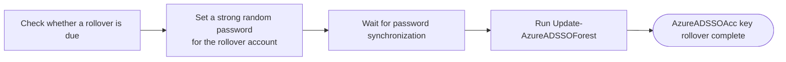

<div align="center">
  

  # AzKerberosRollOver

  **Automated Kerberos key rollover for Microsoft Entra seamless single sign-on**

  [](https://learn.microsoft.com/powershell/)
  [](https://www.microsoft.com/windows)
  [](https://www.microsoft.com/security/business/identity-access/microsoft-entra-id)
  [](LICENSE)
  [](https://buymeacoffee.com/andreaslmuz)

  [Overview](#overview) · [The problem](#the-problem) · [The solution](#the-solution) · [Installation](#installation) · [Script parameters](#script-parameters) · [Monitoring](#monitoring) · [Troubleshooting](#troubleshooting) · [Contributors](#contributors) · [Developer information](#developer-information) · [License](#license)
</div>

---

## Overview

AzKerberosRollOver automates the rollover of the Microsoft Entra seamless single sign-on Kerberos decryption key. The PowerShell script resets a synchronized Active Directory rollover account and updates the `AzureADSSOAcc` computer account through the Microsoft `AzureADSSO` module.

<p>
  🛡️ Securely manages the Kerberos decryption key for Microsoft Entra seamless SSO.<br>
  🔎 Automatically discovers <code>AzureADSSOAcc</code> across the forest.<br>
  🔑 Automatically resets the password for the rollover account.<br>
  👤 Runs the seamless SSO update under the rollover account's identity.<br>
  ✅ Verifies the update directly against the PDC emulator.<br>
  📝 Writes diagnostics to the Windows Application event log.
</p>

## The problem

Microsoft Entra seamless SSO uses the `AzureADSSOAcc` computer account in Active Directory to encrypt and decrypt Kerberos tickets. The password of this account acts as the Kerberos decryption key. If the key is compromised and not rotated regularly, it can remain useful to an attacker for an extended period.

[Microsoft recommends rolling over this key at least every 30 days](https://learn.microsoft.com/entra/identity/hybrid/connect/how-to-connect-sso-faq#how-can-i-roll-over-the-kerberos-decryption-key-of-the-%60azureadsso%60-computer-account).

Microsoft documents the rollover as an interactive administrative process that requires a Microsoft Entra administrator to provide credentials and run the seamless SSO update manually.

## The solution

AzKerberosRollOver is a PowerShell script that automates the password and Kerberos decryption key update process described in the [Microsoft seamless SSO documentation](https://learn.microsoft.com/de-de/entra/identity/hybrid/connect/how-to-connect-sso-faq#wie-kann-ich-den-kerberos-entschl-sselungsschl-ssel-des--azureadsso--computerkontos-erneuern-).

The Microsoft procedure is designed as an interactive administrative workflow. An administrator imports the required modules, authenticates with Microsoft Entra and on-premises credentials, and runs `Update-AzureADSSOForest` for the target forest. AzKerberosRollOver turns these manual steps into a repeatable workflow that can also be scheduled and monitored.

The script uses a synchronized hybrid identity as its rollover account. This account requires the delegated Active Directory permissions needed to update `AzureADSSOAcc` and the **Hybrid Identity Administrator** role in Microsoft Entra ID. During each run, the script generates a new strong random password for the rollover account, synchronizes the credential, and uses the account to run `Update-AzureADSSOForest`.

> [!IMPORTANT]
> No password for the rollover account is stored on disk or written to a log. The randomly generated password exists only in process memory while the script is running and is discarded when the process ends.

### Workflow overview



### azKerberosRollover

The script first loads the required PowerShell modules and checks the configuration, the rollover account, and the timing settings. It then locates the `AzureADSSOAcc` computer account through a Global Catalog and checks when its password was last changed. If Kerberos tickets created with the current key may still be valid, the script stops before making any changes.

When a rollover is safe, the script generates a new 32-character password and assigns it to the synchronized rollover account. It can then start an Entra Connect delta synchronization and checks every 30 seconds whether the new credential is available in Microsoft Entra ID. If authentication succeeds within five minutes, the synchronized account is used to run `Update-AzureADSSOForest` in a background job.

Finally, the script reads `pwdLastSet` directly from the PDC emulator to verify that the password of `AzureADSSOAcc` was updated successfully. The result is recorded in the local log and the Windows Application event log so that scheduled executions can be monitored.

## Installation

### Prerequisites

#### 👤 Worker account

Create a dedicated Active Directory user account to act as the worker account for the rollover process. The account:

- Must be synchronized to Microsoft Entra ID.
- Must have a permanent assignment of the Microsoft Entra **Hybrid Identity Administrator** role.
- Must be excluded from MFA requirements that apply to the noninteractive
  AzureADSSO authentication flow. The script cannot respond to an MFA prompt and
  terminates when MFA or a blocking Conditional Access requirement is detected.

> [!IMPORTANT]
> Limit the MFA or Conditional Access exception to this dedicated rollover account
> and only the conditions required for the rollover. Do not create a broad tenant-wide
> exclusion. Protect the account with the least-privilege permissions documented
> below and monitor its sign-in activity.

#### 🖥️ Entra Connect server

Run the rollover workflow directly on the Microsoft Entra Connect server. This is the
recommended and expected deployment because the required `AzureADSSO` module and its
binary dependencies are installed there.

Running the workflow on another server is possible only when all required PowerShell
modules and their dependencies are installed and the server can reach the required
Active Directory domain controllers and Microsoft Entra endpoints.

#### 🧩 PowerShell modules

Install and import the Active Directory PowerShell module from an elevated Windows
PowerShell session on Windows Server:

```powershell
Install-WindowsFeature -Name RSAT-AD-PowerShell
Import-Module ActiveDirectory
```

Verify that the module is available:

```powershell
Get-Module -ListAvailable -Name ActiveDirectory
```

Microsoft Entra Connect automatically installs the `AzureADSSO` and `ADSync`
PowerShell modules on the Entra Connect server:

- `AzureADSSO` — required for Microsoft Entra authentication and the seamless SSO
  Kerberos key update.
- `ADSync` — required only when `-StartEntraConnectSync` is used.

> [!NOTE]
> The default path of the `AzureADSSO` module is:
> `C:\Program Files\Microsoft Azure Active Directory Connect\AzureADSSO.psd1`

### Copy the script

Download or clone the repository on the Entra Connect server. Open an elevated
Windows PowerShell session in the repository directory and copy the main script and
the `tools` directory to a permanent location. A directory under `Program Files` is
recommended:

```powershell
$installPath = Join-Path $env:ProgramFiles 'AzKerberosRollOver'
$installToolsPath = Join-Path $installPath 'tools'

New-Item -Path $installPath -ItemType Directory -Force | Out-Null
New-Item -Path $installToolsPath -ItemType Directory -Force | Out-Null
Copy-Item -LiteralPath '.\azKerberosRollover.ps1' -Destination $installPath -Force
Copy-Item -Path '.\tools\*' -Destination $installToolsPath -Recurse -Force
```

The resulting paths are:

```text
C:\Program Files\AzKerberosRollOver\azKerberosRollover.ps1
C:\Program Files\AzKerberosRollOver\tools
```

> [!NOTE]
> Keep the script and tools in a protected directory that cannot be modified by
> standard users. Update all installed copies when deploying a newer version.

### Prepare the worker account

The worker account requires **Write** and **Reset Password** on the
`AzureADSSOAcc` computer object. These delegated rights allow
`Update-AzureADSSOForest` to update the object without granting Domain Admin or
Full Control.

Run the permission setup script from the Entra Connect server with an account that
can modify both target ACLs:

```powershell
.\tools\Set-AzKerberosRolloverPermissions.ps1 `
    -RollOverADAccountName 'AzKrbRollOver' `
    -Verbose
```

Use `-WhatIf` first to resolve the accounts and preview all ACL changes. The script
performs these operations:

- Replaces the rollover user's DACL with the current DACL of `AdminSDHolder` from
  the rollover user's domain.
- Disables permission inheritance on the rollover user without preserving its old
  inherited or explicit access rules.
- Grants only **Reset Password** on the rollover user to the Entra Connect computer
  account.
- Grants **Write** and **Reset Password** on `AzureADSSOAcc` to the
  rollover user.

Use `-EntraConnectComputerName` when preparing a different Entra Connect server.
Use `-Force` to suppress both ACL confirmation prompts. `-Force` does not override
`-WhatIf`.

> [!CAUTION]
> The setup script replaces the rollover user's existing permissions with a one-time
> copy of the current `AdminSDHolder` DACL. This does not make the rollover account a
> protected account, and the `AdminSDHolder`/SDProp process does not subsequently
> maintain or reapply these permissions. Always run the setup script with `-WhatIf`
> first and review the target objects.

### Validate the installation

Open an elevated Windows PowerShell session and preview the rollover without making changes:

```powershell
& "$env:ProgramFiles\AzKerberosRollOver\azKerberosRollover.ps1" `
    -RollOverAccountUPN 'AzKrbRollOver@contoso.com' `
    -WhatIf
```

> [!TIP]
> Start with `-WhatIf` to validate the account, modules, directory access, and timing requirements before the first rollover.

### Run the rollover

```powershell
& "$env:ProgramFiles\AzKerberosRollOver\azKerberosRollover.ps1" `
    -RollOverAccountUPN 'AzKrbRollOver@contoso.com'
```

### Create the scheduled task

Use the task setup script from an elevated Windows PowerShell session. It registers
`AzKerberosRollOver` with highest privileges under local `SYSTEM`:

```powershell
New-Item `
    -Path "$env:ProgramData\AzKerberosRollOver\Logs" `
    -ItemType Directory `
    -Force | Out-Null

.\tools\New-AzKerberosRolloverScheduleTask.ps1 `
    -KerberosRollOverAccount 'AzKrbRollOver@contoso.com' `
    -TimeToRun '01:00' `
    -Repeat Daily `
    -Path "$env:ProgramFiles\AzKerberosRollOver" `
    -LogPath "$env:ProgramData\AzKerberosRollOver\Logs" `
    -Force
```

When a value is omitted, the setup script requests it interactively. Press Enter to
accept these defaults:

- `KerberosRollOverAccount`: `svc-KerberosRollOver`
- `TimeToRun`: `01:00`
- `Repeat`: `Daily`
- `Path`: current directory, or its parent when the current directory is named `tools`
- `LogPath`: the default selected by `azKerberosRollover.ps1`

`LogPath`, when supplied, must identify an existing directory. Invalid interactive
input displays a warning and is requested again; leaving it blank uses the rollover
script's default log directory. An invalid value supplied through `-LogPath`
terminates the setup.

`TimeToRun` must be a valid 24-hour time from `00:00` through `23:59`. Invalid
interactive input displays a warning and is requested again. An invalid value supplied
through `-TimeToRun` terminates the setup.

`Repeat` accepts only `Daily`, `Weekly`, or `Hourly`. Invalid interactive input
displays a warning and is requested again. An invalid value supplied through
`-Repeat` terminates the setup.

The rollover account is validated against Active Directory and can be entered as a
`sAMAccountName`, UPN, or `DOMAIN\sAMAccountName`. If an interactively entered
account is not found, the setup script displays a warning and asks again. An invalid
account supplied through `-KerberosRollOverAccount` terminates the setup.

The interactive path prompt expects either the directory that contains
`azKerberosRollover.ps1` or the full path to that file. If the script is not found,
the setup script explains which directory was checked and requests the path again.
An invalid path supplied through `-Path` terminates the setup with an error.
For example, when it is started from
`C:\Program Files\AzKerberosRollOver\tools`, the displayed default is
`C:\Program Files\AzKerberosRollOver`.

`Repeat` accepts `Daily`, `Weekly`, and `Hourly`. A weekly task runs on the weekday
on which it is created. An hourly task starts at the next occurrence of `TimeToRun`.
Use `-WhatIf` to preview registration, `-Verbose` to display the generated action and
also enable verbose rollover logging, and `-Force` to create or update the task
without confirmation.

If the `AzKerberosRollOver` task already exists in the root Task Scheduler folder,
the setup script updates its action, trigger, SYSTEM principal, and settings with
`Set-ScheduledTask`. Otherwise, it creates the task. The task description records:

- the purpose of `azKerberosRollover.ps1`,
- the rollover account,
- the full script path,
- the configured schedule, and
- the Microsoft seamless SSO Kerberos rollover documentation link.

Task Scheduler terminates a rollover process that runs for longer than one hour.
Parallel task instances are not started while an earlier run is still active.

## Monitoring

The script writes detailed execution information to:

- `<LogPath>\azKerberosRollover.ps1.log`
- The Windows Application event log with the source `AzureKrbRollOver`

When `-LogPath` is not specified, the log file is written to `%LOCALAPPDATA%` of the account running the script. The active log is rotated to a single `.sav` file when it exceeds 1 MB.

Read the latest entries from a configured log directory:

```powershell
Get-Content 'C:\Logs\azKerberosRollover.ps1.log' -Tail 50
```

Read recent Windows events generated by the script:

```powershell
Get-WinEvent -FilterHashtable @{
    LogName      = 'Application'
    ProviderName = 'AzureKrbRollOver'
} -MaxEvents 20
```

See the [event ID reference](EventID.md) for the events, severities, and messages written by the script.

> [!NOTE]
> `-WhatIf` does not create or modify log files, event sources, or Windows events.

## Script parameters

The following examples use the installed script path:

```powershell
$scriptPath = "$env:ProgramFiles\AzKerberosRollOver\azKerberosRollover.ps1"
```

### `-AzureADSSOModule`

Specifies the full path to `AzureADSSO.psd1`. The default is the standard Microsoft Entra Connect installation path:

```text
C:\Program Files\Microsoft Azure Active Directory Connect\AzureADSSO.psd1
```

Use a custom module location:

```powershell
& $scriptPath `
    -RollOverAccountUPN 'AzKrbRollOver@contoso.com' `
    -AzureADSSOModule 'D:\EntraConnect\AzureADSSO.psd1'
```

### `-RollOverADAccountName`

Specifies the Active Directory `sAMAccountName` of the synchronized worker account. The default is `AzKrbRollOver`.

Use a worker account with a different `sAMAccountName`:

```powershell
& $scriptPath `
    -RollOverADAccountName 'SvcKrbRollover' `
    -RollOverAccountUPN 'SvcKrbRollover@contoso.com'
```

### `-RollOverAccountUPN`

Specifies the Microsoft Entra UPN of the worker account. When this parameter is omitted, the script reads the UPN from the matching Active Directory user. Supplying it explicitly is recommended for scheduled execution.

```powershell
& $scriptPath `
    -RollOverAccountUPN 'AzKrbRollOver@contoso.com'
```

### `-LogPath`

Specifies the directory for `azKerberosRollover.ps1.log`. When omitted or invalid, the script uses `%LOCALAPPDATA%`. If a file path is supplied, the script uses its parent directory.

Write the log to `C:\Logs`:

```powershell
& $scriptPath `
    -RollOverAccountUPN 'AzKrbRollOver@contoso.com' `
    -LogPath 'C:\Logs'
```

### `-DoNotStartSync`

Prevents the script from calling `Start-ADSyncSyncCycle`. Use this switch when password synchronization is triggered or managed separately.

```powershell
& $scriptPath `
    -RollOverAccountUPN 'AzKrbRollOver@contoso.com' `
    -DoNotStartSync
```

### `-TGTLifetimeHours`

Specifies the minimum age of the current `AzureADSSOAcc` password before another rollover is allowed. The default is `10` hours. Values are limited to `0` through `24`; a value of `0` allows an immediate rollover.

Require the current key to be at least 12 hours old:

```powershell
& $scriptPath `
    -RollOverAccountUPN 'AzKrbRollOver@contoso.com' `
    -TGTLifetimeHours 12
```

### `-IgnoreTGTLifetimeCheck`

Bypasses the TGT lifetime safety check and continues regardless of the previous `AzureADSSOAcc` password update time.

```powershell
& $scriptPath `
    -RollOverAccountUPN 'AzKrbRollOver@contoso.com' `
    -IgnoreTGTLifetimeCheck
```

> [!CAUTION]
> Use `-IgnoreTGTLifetimeCheck` only after assessing the risk. Kerberos tickets issued with the previous key may still be active.

### `-WhatIf`

Validates the prerequisites and reports the planned rollover without changing passwords, starting synchronization, updating seamless SSO, or writing logs.

```powershell
& $scriptPath `
    -RollOverAccountUPN 'AzKrbRollOver@contoso.com' `
    -WhatIf
```

For complete PowerShell help, run:

```powershell
Get-Help $scriptPath -Full
```

## Troubleshooting

Start troubleshooting by reviewing the local log file and the Windows Application events. Use the [event ID reference](EventID.md) to identify the failed stage and its meaning.

### Exit codes

The scheduled PowerShell process returns the following exit codes to Task Scheduler:

| Exit code | Decimal | Meaning | Recommended action |
| --- | ---: | --- | --- |
| `0x0` | `0` | The script completed successfully, or `-WhatIf` completed without making changes. | No action is required. |
| `0x3EA` | `1002` | The `AzureKrbRollOver` Windows event source could not be created. | Run the task with administrative rights or create the event source before the next run. |
| `0x3EB` | `1003` | The updated worker account password was not available in Microsoft Entra ID after five minutes. | Check Entra Connect synchronization health and password hash synchronization before retrying. |
| `0x3EC` | `1004` | Microsoft Entra authentication was blocked by an MFA or Conditional Access requirement. | Review the failed sign-in, per-user MFA, and the applied Conditional Access policies. Exclude the noninteractive rollover account only after an appropriate security review, or use a supported authentication design that satisfies the requirement. |
| `0x1` | `1` | The rollover workflow terminated with another error or ended before completion. | Review the local log and Windows Application events to identify the failed operation. |

The most recent result is displayed in the **Last Run Result** column in Task Scheduler. A value other than `0x0` indicates that the execution requires investigation.

### Windows Event Log

The following errors can be written to the Windows Application event log. See the [event ID reference](EventID.md) for the complete event catalog.

| Event ID | Error | Recommended action |
| --- | --- | --- |
| `3102` | Access was denied while resetting the worker account or running `Update-AzureADSSOForest`. | For password-reset failures, verify that the task runs as `SYSTEM` and that the Entra Connect server computer account has **Reset Password** on the protected worker account. For update failures after successful authentication, verify the worker account's **Hybrid Identity Administrator** role and its required Active Directory permissions on `AzureADSSOAcc`. |
| `3103` | Microsoft Entra authentication was blocked by an MFA or Conditional Access requirement. | Review the failed sign-in, per-user MFA, and the Conditional Access policies shown in the Microsoft Entra sign-in log. |
| `3105` | The new worker account password is not available in Microsoft Entra ID. | Check Entra Connect synchronization health, password hash synchronization, and the worker account's synchronization scope. |
| `3106` | `AzureADSSOAcc` could not be found through the Global Catalog. | Verify that seamless SSO is configured and that the Entra Connect server can contact a Global Catalog. |
| `3108` | The `AzureADSSOAcc` password was not updated by the rollover. | Review the job output and authentication events, then confirm connectivity to the PDC emulator before retrying. |
| `3109` | The configured worker account could not be found in Active Directory. | Verify `-RollOverADAccountName` and confirm that the account exists in the current domain. |
| `3110` | An invalid argument was supplied or a required PowerShell command is unavailable. | Review the supplied parameters and confirm that all required modules and commands are installed. |
| `3111` | A required PowerShell module could not be loaded. | Confirm that `AzureADSSO`, `ActiveDirectory`, and `ADSync` are installed and verify `-AzureADSSOModule`. |
| `3114` | The worker account password was not synchronized to Microsoft Entra ID within five minutes. | Check Entra Connect synchronization health, password hash synchronization, and the worker account's synchronization scope. |
| `3197` | The script could not write to its log file. | Verify that the log directory exists, has free space, and grants write access to the task identity. |
| `3198` | An invalid operation or authentication operation failed. | Review the detailed local log and Microsoft Entra sign-in logs for the underlying exception. |
| `3199` | An unexpected error occurred. | Review the detailed local log and Windows event message for the exception and failed operation. |

Confirm that all required PowerShell modules are available:

```powershell
Get-Module -ListAvailable AzureADSSO, ActiveDirectory, ADSync
```

Run the read-only validation path:

```powershell
& "$env:ProgramFiles\AzKerberosRollOver\azKerberosRollover.ps1" `
    -RollOverAccountUPN 'AzKrbRollOver@contoso.com' `
    -WhatIf
```

Display the complete built-in help:

```powershell
Get-Help "$env:ProgramFiles\AzKerberosRollOver\azKerberosRollover.ps1" -Full
```

## Contributors

AzKerberosRollOver is maintained by [Andreas Lucas (Kili69)](https://github.com/Kili69).

Contributions, bug reports, and improvement suggestions are welcome through the [GitHub repository](https://github.com/Kili69/AzKerberosRollOver).

## Developer information

Repository setup, implementation details, versioning, Git hooks, contribution guidance, and validation procedures are documented in the [developer guide](developer.md).

## License

AzKerberosRollOver is licensed under the [MIT License](LICENSE).
