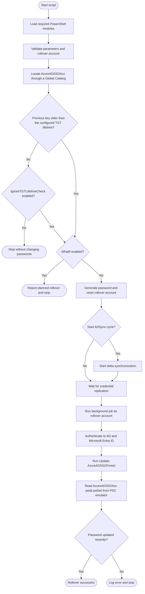

# Developer guide

This document contains contributor information that is intentionally kept separate from the user-focused [README.md](README.md).

## Project resources

| Path | Purpose |
| --- | --- |
| [`azKerberosRollover.ps1`](azKerberosRollover.ps1) | Main rollover script and PowerShell comment-based help. |
| [`README.md`](README.md) | Installation, operation, parameters, and user-facing examples. |
| [`EventID.md`](EventID.md) | Windows event identifier reference. |
| [`CHANGELOG.md`](CHANGELOG.md) | Automatically maintained release history. |
| [`LICENSE`](LICENSE) | MIT License terms for this project. |
| [`.githooks/`](.githooks/) | Repository-managed hooks for regular and merge commits. |
| [`tools/Update-Version.ps1`](tools/Update-Version.ps1) | Version and changelog generator called by the hooks. |

## Initial setup

Clone the repository, switch to the development branch, and enable the repository-managed hooks:

```powershell
git clone https://github.com/Kili69/AzKerberosRollOver.git
Set-Location .\AzKerberosRollOver
git switch dev
git config core.hooksPath .githooks
```

Confirm the hook configuration:

```powershell
git config --local --get core.hooksPath
```

The expected value is `.githooks`.

## Branch workflow

1. Create changes on `dev` or on a short-lived branch based on `dev`.
2. Validate the script and documentation locally.
3. Commit the change with the repository hooks enabled.
4. Push the branch and review the generated version and changelog entry.
5. Merge changes from `dev` into `main`; do not develop directly on `main`.

Avoid force-pushing shared branches. Merges preserve the version ancestry used to calculate the daily counter.

## Versioning

Every regular or merge commit receives a version with this format:

```text
<major>.<minor>.<yyyyMMdd>.<counter>
```

Example:

```text
0.1.20260929.4
```

The components have the following meaning:

| Component | Meaning |
| --- | --- |
| `major` | Manually controlled major version. |
| `minor` | Manually controlled minor version. |
| `yyyyMMdd` | Local commit date generated by the hook. |
| `counter` | Commit sequence for that date, starting at `1`. |

The updater reads `major` and `minor` from the working copy's `.VERSION` metadata. To intentionally change either value, edit the `.VERSION` prefix in [`azKerberosRollover.ps1`](azKerberosRollover.ps1); the hook calculates the date and counter and synchronizes `$ScriptVersion`.

For merge commits, the updater examines both `HEAD` and `MERGE_HEAD` and selects the next counter after the highest parent version for the current date. This prevents a merge from reusing a version already assigned on the other branch.

## Git hooks

The repository uses two hooks:

- `.githooks/pre-commit` handles regular commits.
- `.githooks/pre-merge-commit` handles automatic merge commits.

Both hooks invoke:

```powershell
powershell.exe -NoProfile -ExecutionPolicy Bypass -File .\tools\Update-Version.ps1
```

The updater performs these steps:

1. Reads the current `.VERSION` value from the main script.
2. Calculates the date and daily counter from the commit parent or merge parents.
3. Updates `.VERSION` and `$ScriptVersion`.
4. Converts the currently staged file statuses into a changelog entry.
5. Inserts or refreshes the matching entry in [`CHANGELOG.md`](CHANGELOG.md).
6. Stages the script and changelog so they are included in the same commit.

The update is idempotent for a pending version. Retrying a failed commit refreshes the existing changelog entry instead of appending a duplicate.

## Changelog generation

Changelog entries describe files that were staged before the hook ran. Added, copied, deleted, modified, renamed, type-changed, and unmerged paths are represented explicitly.

Review the generated entry after every commit:

```powershell
git show --stat
git show -- CHANGELOG.md
```

Do not manually add an entry for an ordinary commit. Manual edits are appropriate when correcting historical text or providing release context that cannot be derived from file status alone.

## Complete rollover workflow

The following diagram includes the prerequisite checks, safety decisions, dry-run path, rollover, and final verification:



## PowerShell compatibility

- Keep the script compatible with Windows PowerShell on Microsoft Entra Connect servers.
- Do not introduce PowerShell 7-only syntax unless support requirements are intentionally changed.
- Preserve valid `PSScriptInfo` and comment-based help.
- Never write generated passwords, credentials, access tokens, or other secrets to logs.
- Place all state-changing rollover operations behind `$PSCmdlet.ShouldProcess`.
- Ensure `-WhatIf` performs validation without changing passwords, synchronization state, files, event sources, or Windows events.

## Event IDs

Operational information, warnings, and errors use the Windows Application event log. When adding or changing an event ID:

1. Reuse an existing ID only when its documented meaning remains unchanged.
2. Add new IDs to [`EventID.md`](EventID.md).
3. Keep debug-only messages on event ID `0`.
4. Verify that user-facing troubleshooting text remains actionable.

## Validation

### Parse and metadata checks

Run these checks after changing the PowerShell script:

```powershell
$path = '.\azKerberosRollover.ps1'
$tokens = $null
$errors = $null
[void][System.Management.Automation.Language.Parser]::ParseFile(
    (Resolve-Path $path),
    [ref]$tokens,
    [ref]$errors
)

if ($errors.Count -gt 0) {
    $errors
    throw 'PowerShell syntax validation failed.'
}

Test-ScriptFileInfo -Path $path
```

### Dry-run validation

On a configured Microsoft Entra Connect test host, verify the read-only path:

```powershell
.\azKerberosRollover.ps1 `
    -RollOverAccountUPN 'AzKrbRollOver@contoso.com' `
    -WhatIf
```

Confirm that the command reaches `ShouldProcess`, reports the planned operation, and does not create or modify logs, event sources, passwords, synchronization state, temporary files, or background jobs.

### Repository checks

Before committing:

```powershell
git diff --check
git status --short
git diff
```

After committing:

```powershell
git show --stat
git status --short
```

The worktree should be clean apart from intentionally untracked local editor settings.

## Commit checklist

- The change is based on `dev`.
- PowerShell syntax and `PSScriptInfo` are valid.
- Comment-based help and [README.md](README.md) match user-visible behavior.
- [`EventID.md`](EventID.md) includes any event changes.
- `-WhatIf` remains free of side effects.
- No secrets or environment-specific values are staged.
- The generated version matches the required format.
- The generated changelog entry describes the staged change.
- The commit does not include local `.vscode` settings or unrelated files.

## Troubleshooting hooks

If a commit does not update the version, confirm that the hook path is configured:

```powershell
git config --local --get core.hooksPath
```

Run the updater directly to diagnose an error:

```powershell
powershell.exe -NoProfile -ExecutionPolicy Bypass `
    -File .\tools\Update-Version.ps1
```

The direct command modifies and stages the versioned script and changelog. Review those changes before retrying the commit.
